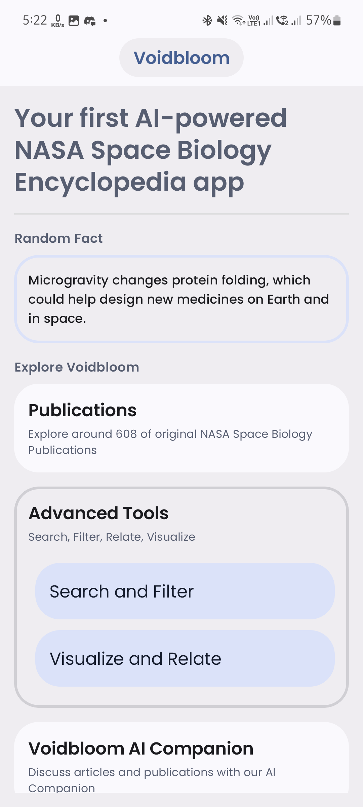
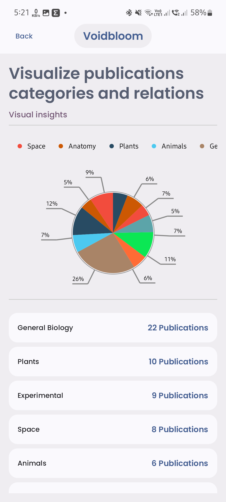
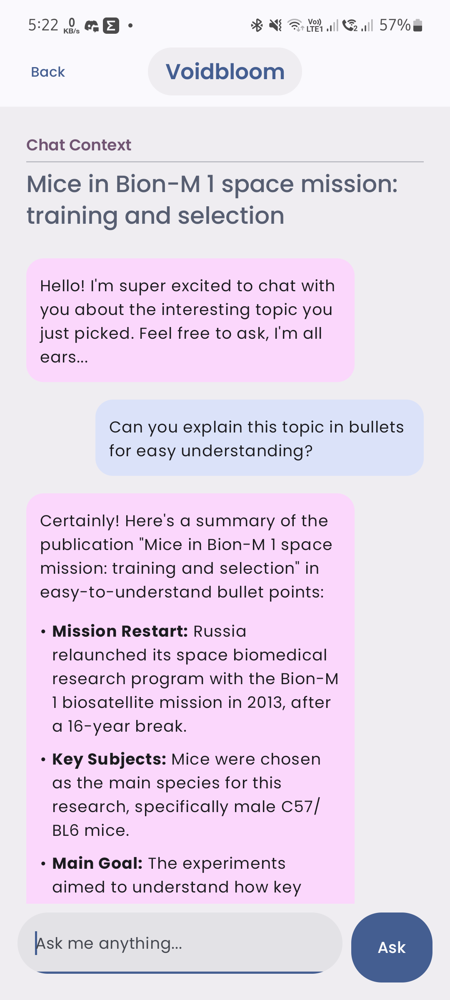
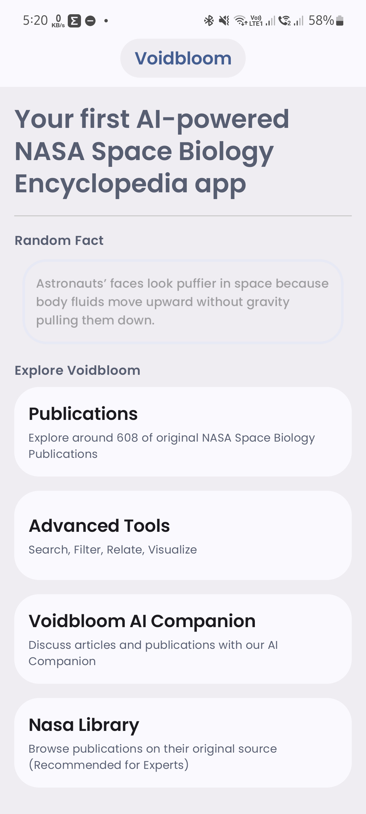

# 🌌 Voidbloom

> *Your first AI-powered NASA Space Biology Encyclopedia app*

Voidbloom is a mobile app designed for the **NASA Space Apps Challenge 2025**.
It helps users explore scientific publications and space knowledge in a whole new way — through **beautiful visualizations** and **conversational AI**.

---

## 📦 Wanna give a try ?

👉 [Download Voidbloom demo apk](https://drive.google.com/file/d/1QEyfoMNNXjyirHJxmX90G8_an516n4rd/view?usp=drive_link)

---

## 📸 Screenshots

| Home                                 | Visualization             | Chat                          |
| ------------------------------------ | ------------------------------- | ----------------------------- |
|  |  |  |

---

## 🎥 Demo Video

Watch Voidbloom in action here:

---

## ✨ What it Does

* 📊 **See Knowledge Bloom**
  Discover connections between research papers and ideas through interactive, dynamic graphs.

* 💬 **Ask & Explore**
  Chat with an AI-powered assistant to simplify, summarize, and guide you through complex information.

* 🎨 **Immersive Experience**
  A sleek, animated interface that makes learning about space feel exciting and intuitive.

---

## 🌱 Our Mission

We believe science should feel alive, not overwhelming.
Voidbloom takes raw data and transforms it into an **engaging journey of discovery**, where anyone — from researchers to curious explorers — can dive into the cosmos of knowledge.

---

## 🏆 Challenge Context

Built for the **NASA Space Apps Challenge 2025** 🌍🚀
> Built totally from scratch by: Ahmed Sleem.
> Team: **Voidbloom**
